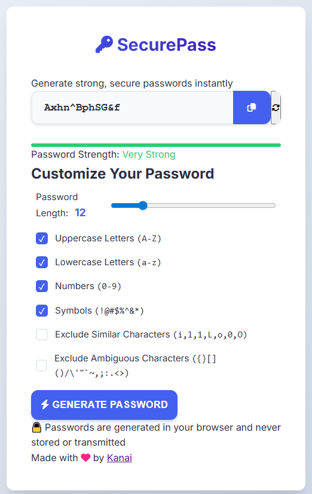

# Password-Generator

A simple web-based password generator.

## Features

- Customizable password length (4–50 characters)
- Options to include/exclude:
  - Uppercase letters (A-Z)
  - Lowercase letters (a-z)
  - Numbers (0-9)
  - Symbols (!@#$%^&*)
  - Similar characters (i, l, 1, L, o, 0, O)
- Copy generated password to clipboard
- Responsive and clean UI

## Usage

1. Open `index.html` in your browser.
2. Adjust the password settings as desired.
3. Click **Generate Password**.
4. Click **Copy** to copy the password to your clipboard.

## Files

- `index.html` – Main HTML file
- `style.css` – Styles for the UI
- `script.js` – Password generation logic
- `README.md` – Project information
